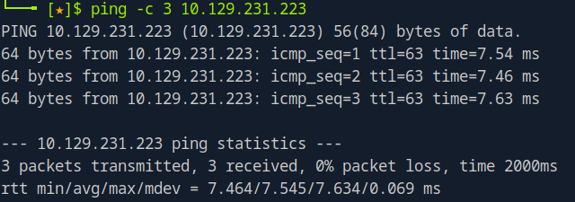

# Dog Writeup

Name: Dog
Date:  
Difficulty:  
Goals:  
Learnt:
Beyond Root:

- [[Dog-Notes.md]]
- [[Dog-CMD-by-CMDs.md]]


## Recon

The time to live(ttl) indicates its OS. It is a decrementation from each hop back to original ping sender. Linux is < 64, Windows is < 128.



I decided I should directory bust before scanning with `nitko` and nuclei plus whatever CMS scanner. This might be the rabbithole find-the-creds-in-the-haystack-full-of-creds box. 


Food is love for some people, but poor doggo can't stop scavenging.


HTB's kind reminder Good dog food, not over feeding and helping your dog's mental health with play and normal life. 

I dumped the .git directory with [git-dumper](https://github.com/arthaud/git-dumper)
```bash
# pip install git-dumper # official way, but 
git-dumper http://sadwebsite.$tdl/.git outputDirectory # --proxy 127.0.0.1 8080
```

And considered how best to fuzz this parameter `?q=FUZZ` as we not only have - `?q=admin`, but also `?q=user/password` potential hits and potential still usin the parameter for directory traversal or some injection attack. Also there is a lot places to check out of the gate so [[Dog-Notes]] was required.

Checking to validate exposed files and directories

And `/admin`

The critical part is that previous tool before running nuclei just read the robots.txt, but `gobuster` could not find them so there is not a misconfigured rabbithole of where to look and test. But the `.git` is dumpable, `?q=` maybe important


Having not needed to see a robots.txt the clean and unclean urls jargon is a bit weird.

So to the dev `?q=` is dirty, but is doing some (early part in) routablity 

Testing to see `?q=` and core


Checking for a version I got this...


Not sure if this means anything is executable


## Exploit

## Foothold

## Privilege Escalation

## Post-Root-Reflection  


## Beyond Root


