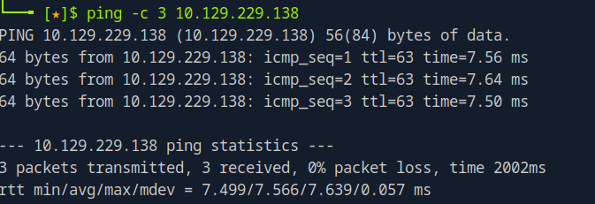

# SwagShop Writeup

Name: SwagShop
Date:  25/09/2025
Difficulty:  Easy
Goals:  
- Try to go from Notes to writing Writeup
- Do a post root reflection
- Try to make and apply a methodology about hacking that everyone better seems to have about (or something like this):
	- I have X
	- Environment Y
	- How does do I get Z with:
		- ... etc
Learnt:
Beyond Root:
- PHP injection 
- Python3 revision

Try to return to Notes 
- [[SwagShop-Notes.md]]
- [[SwagShop-CMD-by-CMDs.md]]


## Recon

The time to live(ttl) indicates its OS. It is a decrementation from each hop back to original ping sender. Linux is < 64, Windows is < 128.

`nmap` scan

`nuclei` found disclosed config and also not http-secure cookies

root creds for mysql, which are not required, but nice none the less


`ssh root` does not work - just in case. Checking the Mysql version in case of sql shanagans

Checking for the version manually


Website is so over-exposed `nikto` is actually very good.


## Shoplift Exploit

There are multiple RCEs for pre 1.9.0.1

Awesomely name shoplift


It 404ed 

There is index.php required in the target URL


Firing off the exploit


And we have access to the panel


## RCE with PHP Injection

Before trying exploits I tried editting the 404 page with a webshell. It was rudely commented out.


`searchsploit -m php/webapps/37811.py`

I tried editing a page and it just put my php in comments

https://github.com/Hackhoven/Magento-RCE/blob/main/magento-rce-exploit.py

Bad regrex over and over again. I later realised that I need the domain name as target not the IP. This because I mistakenly thought mechanize.py work like request. 


And the classic self-reverse-shell-myself-recursive-face-palm-oblivion achived. 


At this point I was confused by the Exploit, it had been multiple hours I check the description for Ippsec writeup was not sending to the login screen for him. But mine was, or was it. I thought that I would try harder and try see what the exploit was doing packet by packet. Another thing that struck me is there are multiple ways to get a shell on the box according to Guided Mode, which I concernedly found no other exploits, Ippsec description did not show that there we alternate ways either.

Trying to question what is going on return as to why is the application used usernames that were emails, but the shoplift exploit could use first name, then remembered its a separate panel and does not need to log in. 

proxychains conf
```c
http 127.0.0.1 8080
```

While my slow internet tears faded I watch the first 18:22 minutes of [Ippsec](https://www.youtube.com/watch?v=qECG2_8xw_s) comparing and gaining those sweet insights.

Apache Rewrite is misconfigure when directories are accessible like `index.php/account`

Learning some very useful python3, with minor change being my rule of always always use the ip for localhost. Instead messing with my proxychains config:
```python
proxy = { "http": "http://127.0.0.1:8080" }
r.request(args,args, proxies=proxy)
```

Stopped at 18:22 because then I could at least trying debugging with burpsuite.

One issue with my proxy to debug plan is that it uses [python3 mechanize](https://mechanize.readthedocs.io/en/latest/)

Look over the code in a less tired state. Why does it iterate over a `br` object when the `request` is were it has stored the `url`


I decided at this point my python is very weak these days and I want to press on and I have never written an exploit PoC, just edited. So started watching and realised he using the `searchsploit` version that also has proxy. So stop and start back again.

Wrong target


The searchsploit exploit finding the what it needs to login   

Feeling unwell at this point I looked over the previous RCE. Realise my mistake in that the browser needs the domain name not the IP. And the https://github.com/Hackhoven/Magento-RCE/blob/main/magento-rce-exploit.py, actually iterates through the forms correctly. Will check how Ippsec fix this in Beyond Root


## Privilege Escalation

We can use `vi` with `sudo` without a password. Vi has a command palette that can interact outside of vi while inside `vi` 


And because (p/t?)ty issues we need to force command on entry to vi not during with the command palette. [gtfobins](https://gtfobins.github.io/gtfobins/vi/#sudo)
```bash
sudo vi /var/www/html/test -c ':!/bin/sh' /dev/null

```

## Post-Root-Reflection  

- Every PoC is different even if it is from the same developer
- I overthought the reverse shell so badly - system can do anything you need

## Beyond Root

Learn about PHP injection from Ippsec
